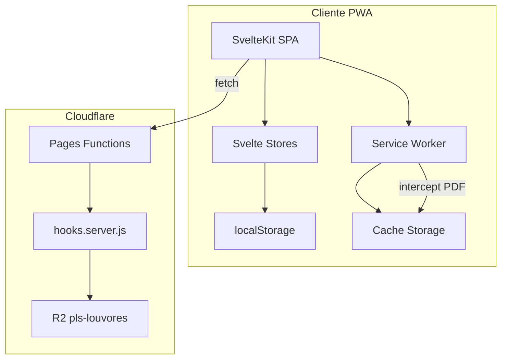
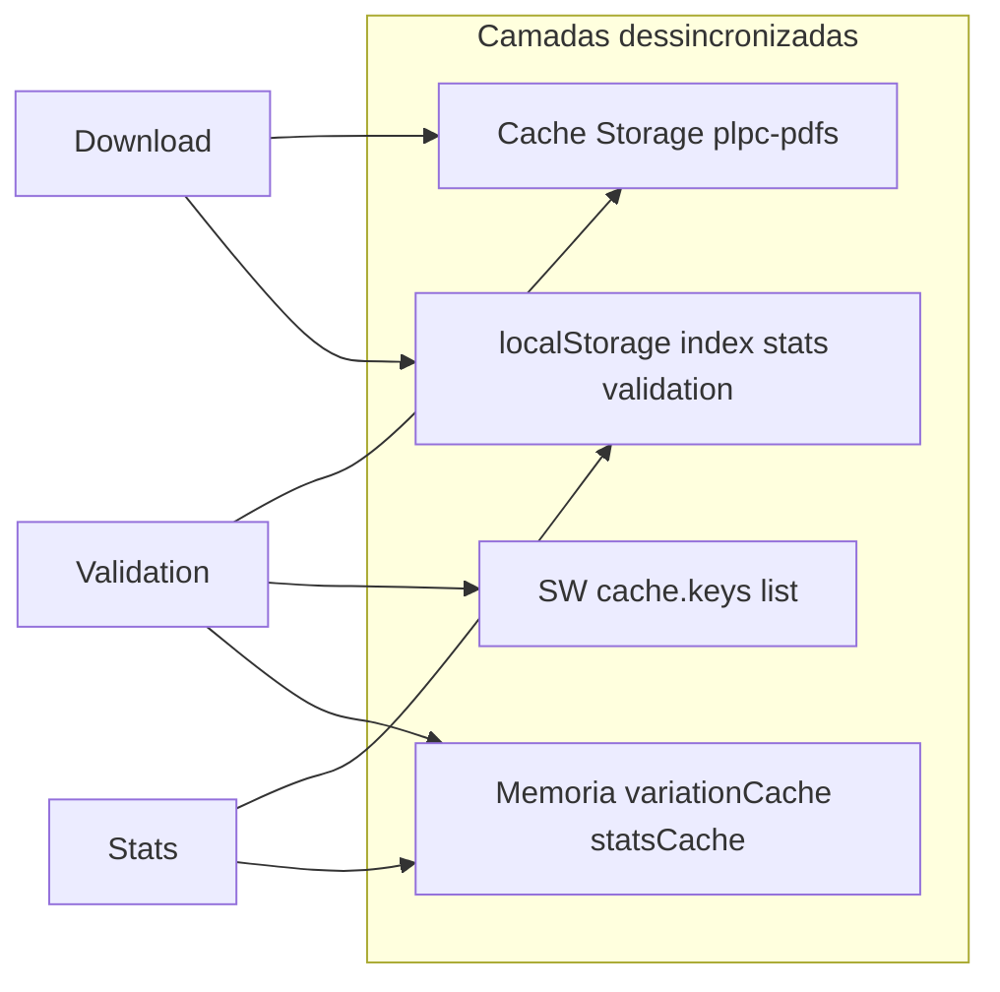
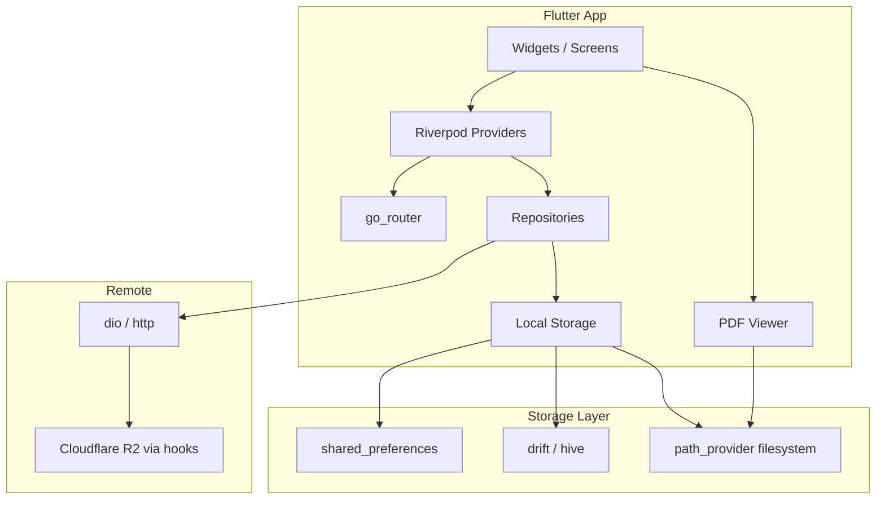

# Mapeamento PLPCG para Migração Flutter 3

Documento de especificação derivado da aplicação **PLPCG** (Pesquisador de Louvores em Partitura, Cifra e Gestos em Gravura) — SvelteKit PWA atual — como base para recriação em **Flutter 3** (iOS, Android, Web).

**Versão do documento:** 1.0  
**Data:** junho de 2026  
**Repositório de origem:** `/Volumes/SSD 2TB SD/dev/plpcjf`

---

## Sumário

1. [Visão geral e stack atual](#1-visão-geral-e-stack-atual)
2. [Rotas, páginas e navegação](#2-rotas-páginas-e-navegação)
3. [Use cases detalhados](#3-use-cases-detalhados)
4. [Features implementadas](#4-features-implementadas)
5. [UI e componentes](#5-ui-e-componentes)
6. [Design system — tema Coletânea Digital](#6-design-system--tema-coletânea-digital)
7. [Requisitos não funcionais](#7-requisitos-não-funcionais)
8. [Modelo de dados e persistência](#8-modelo-de-dados-e-persistência)
9. [Lições aprendidas](#9-lições-aprendidas)
10. [Mapeamento SvelteKit → Flutter 3](#10-mapeamento-sveltekit--flutter-3)
11. [Anexos](#11-anexos)

---

## 1. Visão geral e stack atual

### 1.1 Propósito

O **PLPCG** é um pesquisador e visualizador de partituras, cifras e gestos em gravura de louvores da Igreja Cristã Maranata (ICM). É um projeto **não oficial**, voltado a músicos, regentes e congregações que precisam localizar e ler PDFs de louvores durante ensaios e cultos.

Funcionalidades centrais:

- Busca rápida por número ou título
- Filtros por material (Partitura, Cifra, Gestos em Gravura) e arranjo
- Leitor PDF integrado com gestos e zoom
- Seleção temporária (carousel) e playlists salvas
- Modo offline com download em lote por categoria
- Compartilhamento de playlists e PDFs individuais

O acervo contém **milhares de louvores** (~4600+ PDFs), servidos via Cloudflare R2.

### 1.2 Motivação da migração para Flutter 3

| Problema na PWA atual | Impacto | Direção Flutter |
|----------------------|---------|-----------------|
| Modo offline instável | PDFs no cache mas inacessíveis; stats dessincronizados | Filesystem nativo + índice SQLite/Hive |
| Performance ao gravar cache | Loop sequencial de `cache.put()` bloqueia UI | Gravação paralela + background download |
| Subutilização da tela mobile | PWA com header fixo, hacks iOS (`body position: fixed`) | Layouts nativos, safe areas, NavigationBar |
| Multiplataforma limitada | PWA instalável, sem app stores | Flutter: iOS, Android, Web com codebase único |

### 1.3 Stack tecnológica atual

| Camada | Tecnologia | Versão / Notas |
|--------|------------|----------------|
| Framework | SvelteKit | 2.x |
| UI | Svelte | 4.x |
| Build | Vite | 5.x |
| Estilo | Tailwind CSS + CSS variables | 3.4 |
| Ícones | lucide-svelte | ^0.436 |
| PDF | pdfjs-dist (viewer em `/static/pdfjs/`) | ^4.8 |
| ZIP offline | fflate | ^0.8 |
| Folheto | html2canvas | ^1.4 |
| Deploy | Cloudflare Pages + adapter-cloudflare | — |
| Storage remoto | Cloudflare R2 (`pls-louvores`) | binding `LOUVORES_BUCKET` |
| PWA | Service Worker customizado | `static/sw.js` — **não usa Workbox** (README desatualizado) |
| Modo renderização | SPA pura | `ssr=false`, `csr=true` global |

**Arquivos de configuração centrais:**

- `package.json` — dependências e scripts
- `svelte.config.js` — adapter Cloudflare
- `wrangler.toml` — R2, compat flags
- `src/routes/+layout.js` — SPA global
- `static/sw.js` — Service Worker (~914 linhas)
- `static/manifest.json` — PWA manifest

### 1.4 Arquitetura de dados



**Fluxo de dados principal:**

1. App carrega `louvores-manifest.json` (R2 → fallback static)
2. Usuário busca/filtra louvores em memória (stores Svelte)
3. PDFs servidos via `/assets/{classificacao}/{arquivo}.pdf` (hooks → R2)
4. Modo offline: pacotes ZIP baixados, extraídos, gravados em Cache Storage
5. Service Worker intercepta requisições PDF e serve do cache quando offline

---

## 2. Rotas, páginas e navegação

### 2.1 Rotas de UI

| Rota | Arquivo | Propósito |
|------|---------|-----------|
| `/` | `src/routes/+page.svelte` | **Home / Pesquisador** — busca, filtros colapsáveis, carousel, paginação, deep links de playlist |
| `/biblioteca` | `src/routes/biblioteca/+page.svelte` | **Biblioteca** — browse completo, filtros avançados, ordenação, paginação, refresh do catálogo |
| `/leitor` | `src/routes/leitor/+page.svelte` | **Leitor PDF fullscreen** — toolbar oculta no layout global (~2100 linhas) |
| `/offline` | `src/routes/offline/+page.svelte` | **Configuração offline** — download por categoria, stats, migração, limpeza (~2600 linhas) |
| `/listas` | `src/routes/listas/+page.svelte` | **Playlists salvas** — CRUD, favoritos, compartilhar, abrir no leitor |
| `/sobre` | `src/routes/sobre/+page.svelte` | **Como usar / Quem somos** — placeholders de vídeo |

### 2.2 Layout global

**Arquivo:** `src/routes/+layout.svelte`

- Toolbar fixa no topo com 5 destinos: Sobre, Biblioteca, **PLPCG** (home), Offline, Listas
- Registro do Service Worker (`registerServiceWorker()`)
- Sync de cache entre abas (BroadcastChannel)
- Checksum automático do manifest (poll)
- Preload inteligente de PDF.js por rota
- Correção de mismatch URL vs router SvelteKit em PWA standalone
- No `/leitor`: oculta header global, aplica `body { position: fixed }` no iOS

### 2.3 Endpoints API e assets dinâmicos

| Endpoint | Arquivo | Função |
|----------|---------|--------|
| `GET /louvores-manifest.json` | `src/routes/louvores-manifest.json/+server.js` | Catálogo de louvores (R2 → fallback static) |
| `GET /louvores-manifest.sha256` | `src/routes/louvores-manifest.sha256/+server.js` | Checksum esperado (env `LOUVORES_MANIFEST_CHECKSUM`) |
| `GET /offline-manifest.json` | `src/routes/offline-manifest.json/+server.js` | Manifesto de pacotes ZIP offline (só R2) |
| `POST /api/upload-louvor` | `src/routes/api/upload-louvor/+server.js` | Upload autenticado (JWT) de PDF + atualização do manifest |
| `GET /assets/**/*.pdf` | `src/hooks.server.js` | Serve PDFs do R2 com fallback de encoding |
| `GET /packages/**/*.zip` | `src/hooks.server.js` | Serve pacotes ZIP offline do R2 |

### 2.4 Query params do leitor

| Param | Descrição |
|-------|-----------|
| `file` | Caminho do PDF (ex.: `/assets/ColAdultos/001.pdf`) |
| `titulo` | Título exibido na toolbar |
| `subtitulo` | Subtítulo (categoria/classificação) |
| `validated=true` | Pula revalidação (já validado no card) |

### 2.5 Sincronização URL ↔ estado

**Arquivo:** `src/lib/utils/urlSync.js`

Parâmetros sincronizados com stores:

| Param | Store / uso | Valor padrão (omitido da URL) |
|-------|-------------|-------------------------------|
| `pesquisa` | Texto de busca | vazio |
| `materiais` | Categorias selecionadas (CSV) | todos selecionados |
| `arranjo` | Classificações (CSV) | vazio |
| `arranjoEspecial` | Arranjo especial — só biblioteca (CSV) | vazio |
| `comoAbrir` | Modo de abertura PDF | `leitor` |
| `ordenar` | Ordenação biblioteca | `numero` |
| `itensPorPagina` | Paginação | `10` |
| `pagina` | Página atual | `1` |
| `sharepdfs` | IDs de playlist compartilhada (CSV) | — |
| `sharename` | Nome da playlist compartilhada | — |

---

## 3. Use cases detalhados

### UC-01 — Buscar louvor por número ou texto (Home)

| Campo | Descrição |
|-------|-----------|
| **Ator** | Usuário (músico/regente) |
| **Pré-condições** | Manifest carregado; app online ou offline com catálogo cacheado |
| **Fluxo principal** | 1. Usuário acessa `/`. 2. Expande filtros (opcional). 3. Digita número ou texto na SearchBar. 4. Sistema aplica debounce 300ms e filtra louvores. 5. Resultados exibidos como LouvorCards. |
| **Fluxos alternativos** | Busca vazia → lista vazia (home exige texto; diferente da biblioteca). Número exato → match prioritário. Texto → busca tolerante (acentos, stop words PT). |
| **Pós-condições** | URL atualizada com `pesquisa=`; resultados visíveis |
| **Componentes** | `SearchBar`, `LouvorCard`, stores `louvores`, `filters`, `classificationFilters` |
| **Regras** | Stop words PT removidas (`louvorSearch.js`); tokens pré-computados `_searchContentTokens`, `_searchTitleNorm` |

### UC-02 — Filtrar por material e arranjo

| Campo | Descrição |
|-------|-----------|
| **Ator** | Usuário |
| **Pré-condições** | Filtros visíveis (colapsáveis na home; sempre visíveis na biblioteca) |
| **Fluxo principal** | 1. Seleciona materiais (Partitura, Cifra, Gestos em Gravura). 2. Seleciona arranjos (classificações normalizadas). 3. Na biblioteca: seleciona arranjo especial (texto entre parênteses ou "Padrão"). 4. Resultados filtrados em tempo real. |
| **Regras** | "Cifra" expande para incluir "Cifra nível I" e "Cifra nível II". Filtros sincronizados com URL. |
| **Stores** | `filters.js`, `classificationFilters.js` |

### UC-03 — Navegar biblioteca completa

| Campo | Descrição |
|-------|-----------|
| **Ator** | Usuário |
| **Pré-condições** | Manifest carregado |
| **Fluxo principal** | 1. Acessa `/biblioteca`. 2. Aplica filtros e ordenação (número ou nome). 3. Navega páginas (10/25/50/100 itens). 4. Clica em card para abrir PDF. |
| **Fluxos alternativos** | Banner "Atualizar lista de louvores" → `forceRefreshLouvoresFromNetwork()`. Sem busca → exibe todos os louvores filtrados (diferente da home). |
| **Componentes** | `SortSelector`, `LouvorPaginationControls`, `SpecialArrangementFilters` |

### UC-04 — Abrir PDF (5 modos)

| Campo | Descrição |
|-------|-----------|
| **Ator** | Usuário |
| **Modos** | `leitor` (padrão), `newtab`, `online`, `share`, `save` |
| **Fluxo — leitor** | 1. Seleciona modo "Leitor". 2. Clica card. 3. Valida disponibilidade offline (`validatePdfAvailability`). 4. Navega para `/leitor?file=...&titulo=...`. |
| **Fluxo — share/save** | 1. Seleciona modo. 2. Clica card. 3. Busca blob (cache ou rede). 4. Web Share API ou download. |
| **Fluxo — newtab** | Abre PDF em nova aba, offline-first. |
| **Fluxo — online** | Abre leitor online externo. |
| **Store** | `pdfViewer.js` — valores válidos: `leitor`, `online`, `newtab`, `share`, `save` |

### UC-05 — Montar seleção temporária (carousel)

| Campo | Descrição |
|-------|-----------|
| **Ator** | Usuário |
| **Fluxo principal** | 1. Clica botão "+" no LouvorCard. 2. Louvor adicionado ao carousel (chips). 3. Reordena via drag-and-drop. 4. Remove individual ou limpa tudo. |
| **Persistência** | `localStorage` key `carouselLouvores` |
| **Componentes** | `CarouselChips`, store `carousel.js` |
| **Ações extras** | Salvar como playlist; gerar folheto |

### UC-06 — Gerenciar playlists salvas

| Campo | Descrição |
|-------|-----------|
| **Ator** | Usuário |
| **Fluxo — criar** | Salva carousel atual com nome (default: `lista dd/mm/yyyy HH:mm:ss`). |
| **Fluxo — editar** | Renomear, favoritar, excluir, remover PDF individual da lista. |
| **Fluxo — usar** | Carregar no carousel; abrir 1º no leitor; ver lista expandida (`/listas?viewId=...`). |
| **Modelo** | `{ id, nome, pdfIds[], createdAt, favorita }` |
| **Persistência** | `localStorage` key `savedPlaylists` |

### UC-07 — Compartilhar playlist via URL

| Campo | Descrição |
|-------|-----------|
| **Ator** | Usuário |
| **Fluxo principal** | 1. Em `/listas`, clica Share. 2. Gera URL `/?sharepdfs=id1,id2&sharename=Nome`. 3. Web Share API ou clipboard. 4. Destinatário abre link → carousel carregado + playlist salva automaticamente. |
| **Utilitário** | `playlistUtils.js` — `generatePlaylistShareUrl()`, `sharePlaylistLink()` |

### UC-08 — Gerar folheto da seleção

| Campo | Descrição |
|-------|-----------|
| **Ator** | Usuário |
| **Fluxo principal** | 1. Com louvores no carousel, clica "Gerar folheto". 2. Sistema gera HTML com lista numerada. 3. html2canvas converte em imagem para impressão/compartilhamento. |
| **Utilitário** | `folhetoUtils.js` — fontes Georgia/Times |

### UC-09 — Configurar modo offline (primeira vez)

| Campo | Descrição |
|-------|-----------|
| **Ator** | Usuário |
| **Pré-condições** | Conexão de rede; espaço em disco suficiente |
| **Fluxo principal** | 1. Acessa `/offline`. 2. Seleciona categorias ou "Disponibilizar offline" (todas). 3. Sistema baixa pacotes ZIP via SW. 4. Extrai PDFs (fflate) e grava em Cache Storage. 5. Define `OFFLINE_AVAILABLE=TRUE`. |
| **Fases download** | fetching → extracting → storing → syncing |
| **Componentes** | `DownloadManager`, `PackageDownloader`, `CacheStorageAdapter` |

### UC-10 — Manutenção offline

| Campo | Descrição |
|-------|-----------|
| **Ator** | Usuário |
| **Fluxos** | Ver stats por categoria (lazy load via IntersectionObserver); baixar PDFs faltantes; limpar cache completo; migração automática CacheMigrationV2 |
| **Problemas conhecidos** | Stats podem dessincronizar; limpar PDFs individuais exige limpar cache do navegador (`OfflineModal.svelte`) |

### UC-11 — Ler PDF no leitor

| Campo | Descrição |
|-------|-----------|
| **Ator** | Usuário |
| **Fluxo principal** | 1. PDF abre em `/leitor`. 2. Navega páginas (swipe horizontal ou scroll vertical). 3. Ajusta zoom (page-fit/page-width, pinch, botões +/-). 4. Long-press centro → fullscreen. 5. Navega carousel via CarouselNavigator sem sair. |
| **Offline** | Validação → auto-download via SW → retry → botão "Buscar online" |
| **Preferências** | `pdfPreferredFitMode`, `pdfNavigationMode` em localStorage |
| **Performance debug** | `localStorage plpcjf_perf_debug=1` |

### UC-12 — Atualizar catálogo

| Campo | Descrição |
|-------|-----------|
| **Ator** | Sistema / usuário |
| **Automático** | Poll de `/louvores-manifest.sha256`; refresh quando checksum muda |
| **Manual** | Banner em `/biblioteca` → `forceRefreshLouvoresFromNetwork()` |
| **Retry** | Até 4 tentativas com backoff em conexão instável |

### UC-13 — Upload admin de louvor

| Campo | Descrição |
|-------|-----------|
| **Ator** | Administrador |
| **Pré-condições** | JWT válido (`JWT_SECRET` via Wrangler secret) |
| **Fluxo** | POST `/api/upload-louvor` com PDF base64 + metadata → R2 + append no manifest |
| **Segurança** | HMAC Web Crypto (`jwtUtils.js`); Bearer obrigatório |

### UC-14 — Instalar/usar como PWA standalone

| Campo | Descrição |
|-------|-----------|
| **Ator** | Usuário mobile/desktop |
| **Fluxo** | Prompt nativo do navegador ("Add to Home Screen"); `display: standalone` no manifest |
| **Workarounds** | SW serve shell `/` para rotas não cacheadas; layout corrige com `goto()` |
| **Limitações** | Sem handler `beforeinstallprompt` customizado; sem banner de atualização SW na UI |

---

## 4. Features implementadas

### 4.1 Catálogo e dados

**Modelo de louvor (manifest):**

```json
{
  "nome": "Título do louvor",
  "numero": "123",
  "categoria": "Partitura | Cifra | Cifra nível I | Cifra nível II | Gestos em Gravura",
  "classificacao": "ColAdultos | ColAdultos (Arranjo X)",
  "pdf": "001.pdf",
  "pdfId": "<Base64 UTF-8 URL-safe do caminho relativo>"
}
```

**Campos derivados em runtime:**

- `_searchContentTokens` — tokens de busca pré-computados
- `_searchTitleNorm` — título normalizado para busca

**Decodificação pdfId → caminho:**

- `atobUTF8()` — **nunca** `atob()` puro (latin-1 quebra acentos)
- Resultado: `assets/{classificacao}/{arquivo}.pdf`
- Arquivo: `src/lib/utils/pathUtils.js`

**Categorias de material:**

```javascript
['Partitura', 'Cifra', 'Gestos em Gravura']
```

"Cifra" expande para incluir "Cifra nível I" e "Cifra nível II".

### 4.2 Busca

- Por **número exato** ou **texto no título**
- Remove acentos, stop words PT (~80 palavras funcionais)
- Case-insensitive
- Debounce: 300ms (filtro) + 500ms (sync URL)
- Home: **exige texto** — sem query, lista vazia
- Biblioteca: exibe todos os filtrados sem exigir busca

### 4.3 Filtros e ordenação

| Filtro | Escopo | Store |
|--------|--------|-------|
| Materiais | Home + Biblioteca | `filters.js` |
| Arranjo | Home + Biblioteca | `classificationFilters.js` |
| Arranjo especial | Só Biblioteca | `SpecialArrangementFilters.svelte` |
| Ordenação | Biblioteca | `bibliotecaSort.js` — `numero` \| `nome` |
| Itens/página | Biblioteca | `bibliotecaItemsPerPage.js` — 10, 25, 50, 100 |

### 4.4 Modos de abertura PDF

| Modo | Label UI | Comportamento |
|------|----------|---------------|
| `leitor` | Leitor | Navega para `/leitor` (padrão) |
| `newtab` | Abrir PDF em nova aba | Nova aba, offline-first |
| `online` | Leitor Online | Leitor externo |
| `share` | Compartilhar | Web Share API / download blob |
| `save` | Baixar | Download do PDF |

### 4.5 Carousel e playlists

**Carousel (seleção temporária):**

- Add/remove/reorder (drag), clear
- Persistência: `carouselLouvores`
- `loadPlaylist(pdfIds, allLouvores)` — carrega por IDs

**Playlists salvas:**

- CRUD completo + favoritar
- Nome default: `lista dd/mm/yyyy HH:mm:ss`
- ID: `Date.now().toString(36) + random`
- Persistência: `savedPlaylists`

### 4.6 Leitor PDF

**Arquitetura:**

- `viewerAdapter.js` — adaptador PDF.js
- `zoomController.js` — controle de zoom
- `pdfSourceResolver.js` — resolve fonte (cache/rede)
- `readerPreferences.js` — preferências persistidas

**Modos de navegação:**

- `horizontal` — página única, swipe entre páginas
- `vertical` — scroll contínuo

**Modos de fit:**

- `page-fit` — altura da página
- `page-width` — largura da página

**Gestos:**

- Swipe horizontal — trocar página
- Tap/long-press bordas laterais — página anterior/próxima
- Long-press centro — toggle fullscreen
- Pinch-to-zoom — zoom manual
- Botões +/- — zoom discreto

**Integração carousel:**

- `CarouselNavigator.svelte` na toolbar
- Navega entre louvores sem sair do leitor
- Sync cross-tab via evento `storage`

### 4.7 Offline / PWA

**Módulo refatorado** (`src/lib/offline/`):

```
core/          OfflineManager, OfflineConfig, OfflineEvents
download/      DownloadManager, PackageDownloader, DownloadQueue
storage/       CacheStorageAdapter, CacheMigration, CacheMigrationV2
manifest/      ManifestRepository, R2/Static providers
validation/    CompositeValidator, PdfValidator, NetworkValidator
normalization/ UrlNormalizer, PdfPathManager
stats/         StatsCalculator
```

**Store legado paralelo:** `src/lib/stores/offline.js` (~2450 linhas) — coexistência com módulo novo.

**Caches Service Worker:**

| Nome | Conteúdo |
|------|----------|
| `plpc-v4-app` | App shell, manifest, ícones |
| `plpc-pdfs` | Todos os PDFs offline |
| `plpc-v4-pdfjs` | Módulos PDF.js |

**Fluxo de download offline:**

1. Lê `offline-manifest.json` (pacotes ZIP por categoria)
2. `PackageDownloader` baixa ZIP
3. `fflate` descompacta
4. `CacheStorageAdapter` grava em `plpc-pdfs` (sequencial)
5. SW notificado; stats recalculados; índice PDF atualizado

**Flag de disponibilidade:** `OFFLINE_AVAILABLE=TRUE` em localStorage.

### 4.8 UX transversal

| Feature | Componente / utilitário |
|---------|------------------------|
| Toasts | `AppSnackbarHost`, `AppSnackbarToast`, `appSnackbar.js` |
| Gestos avançados | `GestureButton` + strategy pattern (`gestures/`) |
| Indicador offline | `OfflineIndicator.svelte` (header, canto superior direito) |
| Modais | `ConfirmDialog`, `ErrorModal`, `OfflineModal`, `OfflineRequirementsAlert` |
| Recuperação pós-deploy | `staleChunkRecovery.js` — preserva PDFs, limpa shell |
| Easter egg | `OfflineGestureDetector.svelte` — 7 toques em 5s — **não wired** nas rotas |

### 4.9 Upload admin

- Endpoint: `POST /api/upload-louvor`
- Auth: JWT Bearer (`JWT_SECRET` via `wrangler secret put`)
- Payload: PDF base64 + metadata
- Ação: grava no R2 + append no manifest

---

## 5. UI e componentes

### 5.1 Inventário de componentes (23 arquivos)

**Entrada e busca:**

| Componente | Responsabilidade |
|------------|------------------|
| `SearchBar.svelte` | Campo de busca com animação goldenHeatWave |
| `CategoryFilters.svelte` | Chips de material (Partitura/Cifra/Gestos) |
| `ClassificationFilters.svelte` | Chips de arranjo/classificação |
| `SpecialArrangementFilters.svelte` | Arranjo especial (parênteses) — biblioteca |
| `PdfViewerSelector.svelte` | Select de modo de abertura PDF |
| `SortSelector.svelte` | Ordenação número/nome |

**Resultados:**

| Componente | Responsabilidade |
|------------|------------------|
| `LouvorCard.svelte` | Card de louvor — número, nome, categoria, ações |
| `LouvorPaginationControls.svelte` | Paginação com URL sync e long-press |

**Carousel:**

| Componente | Responsabilidade |
|------------|------------------|
| `CarouselChips.svelte` | Chips reordenáveis, botões salvar/folheto/limpar |
| `CarouselNavigator.svelte` | Navegação entre louvores no leitor |

**Offline:**

| Componente | Responsabilidade |
|------------|------------------|
| `OfflineIndicator.svelte` | Badge vermelho/verde no header |
| `OfflineModal.svelte` | Modal de confirmação/limpeza offline |
| `OfflineRequirementsAlert.svelte` | Alerta de requisitos offline |
| `OfflineGestureDetector.svelte` | Detector 7 toques (não wired) |

**Feedback:**

| Componente | Responsabilidade |
|------------|------------------|
| `AppSnackbarHost.svelte` | Container de toasts |
| `AppSnackbarToast.svelte` | Toast individual (info/success/warning/error) |
| `ConfirmDialog.svelte` | Diálogo de confirmação |
| `ErrorModal.svelte` | Modal de erro |

**Gestos:**

| Componente | Responsabilidade |
|------------|------------------|
| `GestureButton.svelte` | Botão com long-press, tap, haptic |
| `gestures/GestureDetector.js` | Detector base |
| `gestures/LongPressStrategy.js` | Estratégia long-press |
| `gestures/TapStrategy.js` | Estratégia tap |
| `gestures/GestureStrategy.js` | Interface strategy |

### 5.2 Padrões visuais recorrentes

**Container "tag + caixa dourada":**

- Caixa `bg-card-color` (#FFF8E1)
- Borda `2px solid var(--gold-color)` (#D4AF37)
- Label flutuante `.container-tag` no canto superior esquerdo
- Usado em: SearchBar, filtros, PdfViewerSelector, CarouselChips

**Filter chips:**

- Pill `border-radius: 1.25rem`
- Borda `--title-color`; ativo = fundo/borda `--gold-color`

**Header:**

- `fixed top-0`, grid 3 colunas `1fr auto 1fr`
- Borda inferior 4px dourada
- Efeito "light-beam" — linha dourada animada sob botões ativos
- ≤768px: esconde labels, só ícones

**LouvorCard:**

- Grid 2 colunas
- Fundo `--title-color`, borda dourada
- Hover: `--shadow-lg`
- Ícone SVG por categoria (Partitura/Cifra/Gestos)

**Modais:**

- Overlay `rgba(0,0,0,0.6–0.75)`
- Conteúdo `--card-color`, borda dourada
- Botões: Cancel (creme) / Confirm (`--title-color` bg)
- `role="dialog"`, `aria-modal="true"`, Escape fecha

**Leitor:**

- Fullscreen, header global oculto
- Toolbar fixa com botões 36px, ícones SVG 18px
- Área PDF: fundo `#2a2a2a`
- Safe-area-insets via `env(safe-area-inset-*)`

### 5.3 Layout por página

| Página | Layout |
|--------|--------|
| Home / Biblioteca | Coluna centralizada, `max-w-6xl`, cards em coluna vertical |
| Leitor | Fullscreen, toolbar + container PDF scrollável |
| Offline | Seções por categoria, stats, progress bars |
| Listas | Lista de playlists com ações inline |
| Sobre | Conteúdo estático, placeholders vídeo |

**Sem sidebar** — navegação exclusivamente via header fixo.

---

## 6. Design system — tema Coletânea Digital

### 6.1 Identidade visual

Estética "litúrgica/worship": marrom vinho, creme e dourado; tipografia clássica; bordas douradas; animações de brilho na busca e header.

**Nome curto:** PLPCG  
**Nome completo PWA:** Pesquisador de Louvores em Partitura, Cifra e Gestinhos  
**Descrição:** Pesquisador e visualizador online e offline de partituras, cifras e gestinhos de louvores da ICM (Não Oficial)

### 6.2 Paleta de cores

**Tokens CSS** (`src/app.css`, `tailwind.config.js`):

| Token | Hex | Uso |
|-------|-----|-----|
| `--background-color` | `#4B2D2B` | Fundo global (marrom escuro) |
| `--card-color` | `#FFF8E1` | Cards, containers, modais |
| `--card-bg` | `#f8f9fa` | Snackbars |
| `--title-color` | `#6A2F2F` | Títulos, cards, botões primários |
| `--gold-color` | `#D4AF37` | Bordas, acentos, theme-color |
| `--gold-light` | `#F4D03F` | Hover chips, animações |
| `--placeholder-color` | `#F0E68C` | Título PLPCG, destaque header |
| `--btn-background-color` | `#6A3B39` | Botões leitor, clear search |
| `--text-light` | `#ffffff` | Texto sobre fundo escuro |
| `--text-dark` | `#2c3e50` | Texto sobre fundo claro |
| `--badge-blue-bg` | `#5a7a9c` | Badges |
| `--badge-gray-bg` | `#9ca3af` | Estado disabled |
| `--shadow-md` | `0 4px 6px rgba(0,0,0,0.1)` | Elevação padrão |
| `--shadow-lg` | `0 10px 15px rgba(0,0,0,0.2)` | Hover, snackbars |

**Cores ad hoc (fora dos tokens):**

| Contexto | Cores |
|----------|-------|
| Snackbars | info `#4f83cc`, success `#3c9a5f`, warning `#d5a324`, error `#d06767` |
| Offline indicator | offline `#dc3545`, ready `#28a745` |
| Info boxes (modal offline) | bg `#d1ecf1`, border `#17a2b8`, text `#0c5460` |
| Área PDF leitor | `#2a2a2a` |
| Light-beam header | gradientes `rgba(255, 220, 100, …)` |

### 6.3 Tipografia

**Carregamento** (`src/app.html`):

```html
<link href="https://fonts.googleapis.com/css2?family=EB+Garamond:wght@400;700&family=Open+Sans:wght@400;500;600&display=swap" rel="stylesheet">
```

| Família | Pesos | Uso |
|---------|-------|-----|
| EB Garamond | 400, 700 | `font-garamond` — h1–h3, PLPCG, cards, modais |
| Open Sans | 400, 500, 600 | `font-sans` — corpo (`body`) |
| Garamond (fallback) | — | Header ativo |
| Georgia / Times New Roman | — | Folhetos gerados |

**Estilos globais:**

- `body`: Open Sans, fundo marrom, texto branco
- `h1, h2, h3`: Garamond bold + `tracking-wide` + text-shadow
- `.subtitle-inset`: sombra inset multicamada (efeito relevo)

### 6.4 Espaçamento e radius

| Token Tailwind | Valor |
|----------------|-------|
| `borderRadius.DEFAULT` | 8px |
| `borderRadius.card` | 12px |
| `borderRadius.chip` | 24px |
| `spacing.0.5` | 0.5rem |
| `spacing.1` | 1rem |
| `spacing.1.5` | 1.5rem |
| `spacing.2` | 2rem |

### 6.6 Responsividade

| Breakpoint | Comportamento |
|------------|---------------|
| ≤480px | CarouselChips: botões só ícone |
| ≤640px | Modais empilham botões; paginação compacta |
| ≤768px | Header: só ícones; chips padding reduzido |
| ≥768px | Filtros em linha única |
| ≥1024px | Filtros gap maior |
| ≤767px / ≤1023px | Leitor: lógica JS mobile/tablet |

**Mobile-first / touch:**

- `viewport-fit=cover` + safe-area-insets
- `-webkit-tap-highlight-color: transparent`
- `@media (hover: hover)` vs `(pointer: coarse)` — hover desktop, `:active` touch
- Leitor iOS: `body { position: fixed }` para evitar scroll residual

**Larguras máximas:**

- Páginas: `max-w-6xl` (896px)
- Search bar: `max-width: 56rem`

### 6.7 Modo escuro/claro

| Área | Comportamento |
|------|---------------|
| App PLPCG | **Tema único** — sem toggle, sem `prefers-color-scheme` |
| Leitor PDF | Fundo cinza escuro `#2a2a2a` |
| PDF.js viewer CSS | Suporte nativo dark (paleta Mozilla) |
| Manifest | `background_color: #ffffff` — **diverge** do fundo real `#4B2D2B` |

### 6.8 Branding e assets PWA

| Asset | Referência |
|-------|------------|
| `favicon.svg` | `src/app.html`, `static/sw.js` |
| `icon-192.png`, `icon-512.png` | `static/manifest.json` — purpose `any maskable` |
| `theme-color` | `#D4AF37` |
| Ícones UI | lucide-svelte + SVG inline (header, categorias) |

### 6.9 Acessibilidade

**Pontos positivos:**

- `lang="pt-BR"` em `app.html`
- `aria-label` em botões header e leitor
- Modais: `role="dialog"`, `aria-modal`, `aria-labelledby`
- Snackbars: `role="status"`, `aria-live="polite"`
- Filtros: `aria-expanded`, `aria-controls`
- `prefers-reduced-motion` parcial (scroll biblioteca)
- Paginação: `aria-label` em selects

**Gaps:**

- `app.css` remove `outline` de **todos** inputs em focus — prejudica teclado
- Alguns `<div role="button">` em vez de `<button>`
- Contraste `#F0E68C` sobre `#4B2D2B` limítrofe WCAG
- Animação `goldenHeatWave` sem checagem `prefers-reduced-motion`

---

## 7. Requisitos não funcionais

### 7.1 Matriz de requisitos

| Categoria | Requisito | Estado atual | Notas |
|-----------|-----------|--------------|-------|
| **Offline-first** | PDFs, shell, PDF.js cacheados; flag OFFLINE_AVAILABLE | ⚠️ Parcial | Falhas lookup; stats dessincronizados |
| **Performance** | Debounce, lazy stats, batch cache, preload PDF.js | ⚠️ Gargalos | Leitor 8–17s; gravação sequencial |
| **Disponibilidade** | Cloudflare CDN + R2; fallback manifest static | ✅ OK | — |
| **Integridade** | SHA-256 manifest; CompositeValidator | ✅ OK | Edge cases de path |
| **Segurança** | JWT upload; CORS `*`; sem CSP | ⚠️ Parcial | Upload OK; CSP ausente |
| **Multiplataforma** | PWA standalone + web responsiva | ⚠️ Parcial | Mobile nativo limitado |
| **Manutenibilidade** | Refatoração offline em módulos | ⚠️ Parcial | Duplicação store legado |
| **Testabilidade** | 6 testes vitest | ❌ Fraca | Vitest não no package.json |
| **Deploy** | Cloudflare Pages, wrangler deploy | ✅ OK | — |
| **i18n** | pt-BR hardcoded | ✅ Único idioma | — |
| **Storage quota** | Cache Storage + localStorage | ⚠️ Problema | QuotaExceededError |

### 7.2 Estratégias Service Worker por recurso

| Recurso | Estratégia | Notas |
|---------|-----------|-------|
| PDFs (`.pdf`) | Cache-first + variações URL | Normalização via `sw-utils.js` |
| PDF.js (`/pdfjs/`) | Cache-first | Pré-cache no install |
| Navegação SPA | Network-first (prod) | Dev = rede pura |
| App shell | Cache-first / install addAll | Manifest ~1.3MB excluído do install |
| ZIPs `/packages/*.zip` | Network-only | Nunca cacheados |
| `louvores-manifest.sha256` | Sempre rede | `no-store` |
| Assets `/_app/immutable/` | Network-first + cache prod | staleChunkRecovery pós-deploy |
| Assets Vite dev | Sem cache | `no-store` |

### 7.3 Performance — otimizações e gargalos

**Otimizações implementadas:**

- Batch mode ao gravar PDFs (sem eventos/SW por item)
- `getCachedPDFsFast()` com cache local TTL 5 min
- Timeout SW reduzido para 500 ms
- Pré-carregamento inteligente PDF.js
- PDF index: debounce, session cache 5 min
- Stats v2 comprimido + invalidação seletiva
- Processamento em chunks na página offline
- `_variationCache` / `_missCache` em lookups

**Gargalos críticos:**

| Gargalo | Impacto | Referência |
|---------|---------|------------|
| Validação dupla (card + leitor) | +2–5s abertura | `INVESTIGACAO_LENTIDAO_LEITOR.md` |
| Múltiplos `waitForServiceWorker()` | +5s encadeados | idem |
| `cache.keys()` O(n) no SW | Escala mal com 4600+ PDFs | `static/sw.js` |
| Gravação sequencial `cache.put()` | UI congela na fase storing | `PackageDownloader.js` |
| PDF index verificado repetidamente | Bloqueio UI | `SOLUCOES_PDF_INDEX.md` |
| Múltiplos caches dessincronizados | Stats/validação incorretos | `RELATORIO_MODO_OFFLINE.md` |

### 7.4 Segurança

| Aspecto | Implementação |
|---------|---------------|
| Auth upload | JWT HMAC Web Crypto (`jwtUtils.js`) |
| Secret | `wrangler secret put JWT_SECRET` |
| CORS | `Access-Control-Allow-Origin: *` em PDF, manifest, upload |
| CSP | **Não implementado** |
| Checksum manifest | Env `LOUVORES_MANIFEST_CHECKSUM` |
| Cache PDFs | `Cache-Control: public, max-age=31536000` |

### 7.5 Deploy

- **Adapter:** `@sveltejs/adapter-cloudflare`
- **Output:** `.svelte-kit/cloudflare`
- **R2:** bucket `pls-louvores`, binding `LOUVORES_BUCKET`
- **Scripts:** `npm run deploy`, `npm run dev:cloudflare`
- **Build:** `vite build` → Cloudflare Pages

### 7.6 Testes

| Tipo | Situação |
|------|----------|
| Unitários | 6 arquivos `*.test.js` (vitest não instalado) |
| Manual | `TESTING_CHECKLIST.md` (desatualizado: pls-v3 vs plpc-v4) |
| Cobertura offline | PdfValidator, UrlNormalizer, PdfPathManager |

**Arquivos de teste:**

- `src/lib/offline/validation/PdfValidator.test.js`
- `src/lib/offline/normalization/UrlNormalizer.test.js`
- `src/lib/offline/utils/PdfPathManager.test.js`
- `src/lib/utils/louvoresManifestChecksum.test.js`
- `src/lib/stores/louvores.checksum.test.js`
- `src/lib/stores/louvores.versioning.test.js`

---

## 8. Modelo de dados e persistência

### 8.1 Gerenciamento de estado (Svelte stores)

| Store | Arquivo | Persistência | Escopo |
|-------|---------|--------------|--------|
| `louvores` | `stores/louvores.js` | Memória (+ SW cache manifest) | Catálogo global |
| `filters` | `stores/filters.js` | URL `materiais` | Categorias |
| `classificationFilters` | `stores/classificationFilters.js` | URL `arranjo` | Classificações |
| `carousel` | `stores/carousel.js` | localStorage | Seleção temporária |
| `savedPlaylists` | `stores/savedPlaylists.js` | localStorage | Playlists |
| `pdfViewer` | `stores/pdfViewer.js` | URL `comoAbrir` | Modo abertura |
| `bibliotecaSort` | `stores/bibliotecaSort.js` | URL `ordenar` | Ordenação |
| `bibliotecaItemsPerPage` | `stores/bibliotecaItemsPerPage.js` | URL `itensPorPagina` | Paginação |
| `offline` | `stores/offline.js` | localStorage + Cache API | Estado offline |

**Cross-tab sync:**

- Carousel: evento `storage`
- Cache PDF: BroadcastChannel `pdf-cache-sync` (`cacheSync.js`)

### 8.2 Chaves localStorage

| Key | Propósito | TTL / Notas |
|-----|-----------|-------------|
| `carouselLouvores` | Seleção temporária | — |
| `savedPlaylists` | Playlists salvas | — |
| `cachedPdfsList` | Lista URLs PDFs cacheados | — |
| `OFFLINE_AVAILABLE` | Flag modo offline pronto | `'TRUE'` |
| `ALLOW_OFFLINE` | Permissão offline | `'true'` |
| `IS_LEITOR_OFFLINE` | Leitor em modo offline | `'true'` |
| `selectedCategoriesForDownload` | Categorias selecionadas | JSON array |
| `downloadedCategories` | Categorias baixadas (legado) | JSON array |
| `OFFLINE_CATEGORIAS_SALVAS` | Categorias baixadas (novo) | JSON array |
| `offlineManifest` | Cache manifest offline | — |
| `lastManifestHash` | Hash último manifest | — |
| `pdfPreferredFitMode` | Preferência fit leitor | `page-fit` \| `page-width` |
| `pdfNavigationMode` | Preferência navegação | `horizontal` \| `vertical` |
| `plpcjf_perf_debug` | Debug performance leitor | `'1'` |
| `PDF_INDEX_KEY` (pdfIndex.js) | Índice PDF local | Session cache 5 min |
| `STATS_CACHE_KEY` (statsCache.js) | Stats offline comprimidos | TTL 5 min |
| `cache_migration_v2_completed` | Flag migração V2 | — |
| Checksum keys (louvoresManifestChecksum.js) | SHA-256, sync penalty | — |
| Validation cache keys | Por pdfId | TTL 24h |
| Manifest cache keys (ManifestCache.js) | Manifests em cache | TTL 5 min |

### 8.3 Camadas de cache (problema central)



**Problema:** Quando um PDF é baixado, nem todas as camadas são invalidadas consistentemente, causando:

- PDFs no cache mas "não encontrados" na validação
- Stats desatualizados após download
- Performance degradada por lookups O(n)

### 8.4 Normalização de paths (spec crítica para Flutter)

**Duas funções distintas:**

| Função | Comportamento | Uso |
|--------|---------------|-----|
| `getPdfRelPath(louvor)` | Decodifica pdfId UTF-8; **preserva case e acentos** | Construir URL de fetch |
| `normalizePdfUrl(url)` | Lowercase, remove acentos, decode URI, prefix `assets/` | Comparação/lookup no cache |

**Passos de `normalizePdfUrl`:**

1. Remove protocolo/domínio
2. Remove barras leading/trailing
3. Decode URI (até 3x)
4. Normaliza acentos → ASCII (`nível` → `nivel`)
5. Lowercase
6. Normaliza separadores (`\` → `/`)
7. Garante prefixo `assets/`

**Regra crítica:** SW, app e R2 devem usar a **mesma regra** de normalização para lookup. Divergência causa PDFs "baixados mas inacessíveis offline".

**Arquivos de referência:**

- `src/lib/utils/pathUtils.js`
- `src/lib/offline/utils/PdfPathManager.js`
- `src/lib/offline/normalization/UrlNormalizer.js`
- `static/sw-utils.js`

### 8.5 Configuração offline centralizada

**Arquivo:** `src/lib/offline/core/OfflineConfig.js`

| Config | Valor |
|--------|-------|
| `PDF_CACHE_NAME` | `plpc-pdfs` |
| `MANIFEST_CACHE_TTL` | 5 min |
| `VALIDATION_CACHE_TTL` | 24 h |
| `STATS_CACHE_TTL` | 5 min |
| `SW_REGISTRATION_TIMEOUT` | 5 s |
| `SW_READY_TIMEOUT` | 500 ms |
| `DEFAULT_BATCH_SIZE` | 10 |
| `MAX_RETRY_ATTEMPTS` | 3 |

---

## 9. Lições aprendidas

### 9.1 Manter (funcionou bem)

| Item | Por quê manter |
|------|----------------|
| Tema visual "Coletânea Digital" | Identidade clara, reconhecível, adequada ao contexto litúrgico |
| Modelo manifest + pdfId Base64 UTF-8 | Estrutura de dados estável; backend reutilizável |
| Busca tolerante com tokens pré-computados | Performance e UX de busca excelentes |
| Sincronização filtros ↔ URL | Deep links, compartilhamento, bookmarking |
| Carousel + playlists | Fluxo real de ensaio/culto; alto valor para usuários |
| Leitor PDF rico (gestos, zoom, modos) | UX diferenciada; portar integralmente |
| Checksum automático do manifest | Atualização transparente do catálogo |
| Backend Cloudflare R2 | Mesmo HTTP no Flutter; sem mudança de infra |
| Pacotes ZIP por categoria | Estratégia de download em lote eficiente |
| PdfPathManager / UrlNormalizer | Extrair como spec independente de plataforma |

### 9.2 Melhorar (motivação Flutter)

| Área | Problema PWA | Solução Flutter |
|------|--------------|-----------------|
| **Offline** | SW + Cache Storage instável | `path_provider` + SQLite/Hive; `background_downloader` / workmanager |
| **Gravação cache** | Loop sequencial na main thread | Gravação paralela em isolate; progress stream |
| **Lookup PDF** | O(n) `cache.keys()` | Índice O(1) por pdfId em SQLite |
| **Validação** | Dupla validação card + leitor | Validação única; passar flag `validated` |
| **Uso de tela** | Header fixo, hacks iOS | NavigationBar nativa; split view tablet; gestos nativos |
| **Estado** | Stores Svelte + urlSync manual | Riverpod/Bloc + go_router query params |
| **Testes** | 6 testes, vitest ausente | Suite automatizada paths + offline + busca |
| **Quota** | localStorage competindo | Separar metadados (SQLite) de blobs (filesystem) |

### 9.3 Descartar / simplificar

| Item | Motivo |
|------|--------|
| Duplicação `offline.js` (2450 linhas) + módulo novo | Arquitetura única no Flutter |
| Registro SW duplo (app.html + layout) | N/A em Flutter |
| Múltiplos caches localStorage | Consolidar em SQLite/Hive |
| Workarounds SPA standalone routing | go_router nativo |
| Documentação Workbox (não usado) | Atualizar docs |
| Easter egg 7 toques (não wired) | Baixa prioridade |
| staleChunkRecovery | Problema específico SvelteKit chunks |
| Service Worker messaging | Substituir por isolates/streams |

### 9.4 Pain points documentados

| Documento | Conteúdo |
|-----------|----------|
| `RELATORIO_MODO_OFFLINE.md` | Análise crítica offline; plano refatoração 6 fases |
| `INVESTIGACAO_LENTIDAO_LEITOR.md` | Gargalos abertura 8–17s; recomendações |
| `SOLUCOES_PDF_INDEX.md` | Index verificado 5×/min bloqueando UI |
| `PLANO_FASE3_IMPLEMENTACAO.md` | Stats offline: persistência, lazy loading |
| `ANALISE_VIABILIDADE_CAROUSEL_LEITOR.md` | Carousel integrado no leitor |
| `ANALISE_GESTURE_BUTTON.md` | Padrão de gestos |
| `TESTING_CHECKLIST.md` | QA manual (parcialmente desatualizado) |

### 9.5 Issues conhecidos não resolvidos

| Issue | Severidade |
|-------|------------|
| PDFs baixados não abrem offline (normalização) | Crítico |
| Stats não refletem downloads | Crítico |
| Lentidão leitor ~10s | Performance |
| UI bloqueada na fase storing | Performance |
| Impossível remover PDF individual do cache | UX |
| TODO: download PDF individual (`DownloadManager.js`) | Funcional |
| TODO: fallback download categoria completa | Funcional |

---

## 10. Mapeamento SvelteKit → Flutter 3

### 10.1 Tabela de equivalências

| Web (PLPCG) | Flutter 3 |
|-------------|-----------|
| Svelte stores + urlSync | Riverpod ou Bloc + go_router query params |
| localStorage | shared_preferences + hive ou drift |
| Cache Storage + Service Worker | path_provider + sqflite/drift + background_downloader |
| pdfjs-dist viewer | pdfx, syncfusion_flutter_pdfviewer ou native PDFView |
| BroadcastChannel | StreamController / isolates |
| Web Share API | share_plus |
| html2canvas (folheto) | screenshot package + pdf |
| fflate (ZIP) | archive package |
| lucide-svelte | lucide_icons ou flutter_svg |
| Tailwind + CSS variables | ThemeData + extensions customizadas |
| Cloudflare R2 | Mesmo backend HTTP (dio/http) |
| JWT upload | Mesmo endpoint; dart jsonwebtoken ou http bearer |
| PWA install | App stores (iOS/Android); PWA via flutter build web |

### 10.2 Prioridades de paridade

**Alta (MVP Flutter):**

1. Catálogo + carregamento manifest
2. Busca por número/texto
3. Filtros (material, arranjo)
4. Biblioteca com ordenação e paginação
5. Leitor PDF com gestos e zoom
6. Modo offline (download, storage, lookup)

**Média:**

7. Carousel (seleção temporária)
8. Playlists (CRUD, favoritos)
9. Compartilhamento (playlist URL, PDF individual)
10. Folheto
11. Indicador offline
12. Checksum automático manifest

**Baixa:**

13. Upload admin JWT
14. Easter egg gestos
15. staleChunkRecovery equivalente
16. Modo "leitor online externo"

### 10.3 Spec crítica a implementar antes de codar

Extrair regras de normalização como **contrato independente de plataforma**:

```
1. pdfId = Base64 UTF-8 URL-safe de "assets/{classificacao}/{arquivo}.pdf"
2. Decodificação: Base64 → bytes → UTF-8 string (NUNCA latin-1)
3. Lookup key: normalize(path) = lowercase + ASCII accents + decode URI + prefix assets/
4. Storage path: filesystem path usando classificacao/arquivo originais (preservar case)
5. Index: mapa pdfId → storage path para O(1) lookup
```

**Testes obrigatórios:**

- pdfId com acentos (Cifra nível I/II)
- Double/triple URI encoding
- Case variations
- Paths com espaços e caracteres especiais

### 10.4 Arquitetura Flutter sugerida



**Pacotes Flutter recomendados:**

| Necessidade | Pacote |
|-------------|--------|
| Estado | flutter_riverpod |
| Roteamento | go_router |
| HTTP | dio |
| Storage leve | shared_preferences |
| Storage estruturado | drift ou hive |
| Filesystem | path_provider |
| Download background | background_downloader ou flutter_downloader |
| PDF | pdfx ou syncfusion_flutter_pdfviewer |
| Compartilhar | share_plus |
| ZIP | archive |
| Ícones | lucide_icons |

### 10.5 Telas Flutter sugeridas

| Tela SvelteKit | Screen Flutter | Notas |
|----------------|----------------|-------|
| `/` | `HomeScreen` | Busca + filtros colapsáveis |
| `/biblioteca` | `LibraryScreen` | Filtros expandidos + paginação |
| `/leitor` | `PdfReaderScreen` | Fullscreen, sem AppBar global |
| `/offline` | `OfflineSettingsScreen` | Download + stats |
| `/listas` | `PlaylistsScreen` | CRUD playlists |
| `/sobre` | `AboutScreen` | Estático |

**Navegação:** BottomNavigationBar ou NavigationRail (tablet) substituindo header fixo — melhor uso de tela mobile.

---

## 11. Anexos

### 11.1 Endpoints API completos

| Método | Endpoint | Auth | Resposta |
|--------|----------|------|----------|
| GET | `/louvores-manifest.json` | — | Array JSON de louvores |
| GET | `/louvores-manifest.sha256` | — | Hex SHA-256 ou 204 |
| GET | `/offline-manifest.json` | — | Pacotes ZIP por categoria |
| GET | `/assets/**/*.pdf` | — | PDF binary (R2) |
| GET | `/packages/**/*.zip` | — | ZIP binary (R2) |
| POST | `/api/upload-louvor` | JWT Bearer | Upload + manifest update |

### 11.2 Mensagens Service Worker

| Tipo | Direção | Função |
|------|---------|--------|
| `DOWNLOAD_PDFS` | App → SW | Batch download PDFs |
| `CANCEL_DOWNLOAD` | App → SW | Cancelar download |
| `GET_CACHED_PDFS` | App → SW | Listar PDFs cacheados |
| `CLEAR_CACHE` | App → SW | Limpar cache app |
| `CLEAR_PDF_CACHE_ENTRY` | App → SW | Remover PDF individual |
| `CACHE_UPDATED` | SW → App | Notificar atualização |

### 11.3 Documentação existente no repositório

| Arquivo | Conteúdo |
|---------|----------|
| `README.md` | Stack, setup, deploy (parcialmente desatualizado) |
| `MIGRATION_SUMMARY.md` | Migração vanilla → SvelteKit |
| `RELATORIO_MODO_OFFLINE.md` | Análise crítica offline |
| `PLANO_FASE3_IMPLEMENTACAO.md` | Fase 3 offline |
| `TESTING_CHECKLIST.md` | Checklist QA manual |
| `SOLUCOES_PDF_INDEX.md` | PDF index localStorage |
| `INVESTIGACAO_LENTIDAO_LEITOR.md` | Performance leitor |
| `ANALISE_VIABILIDADE_CAROUSEL_LEITOR.md` | Carousel no leitor |
| `ANALISE_GESTURE_BUTTON.md` | Gestos |
| `ANALISE_VIABILIDADE_TOQUE_DUPLO.md` | Double tap |
| `PLANEJAMENTO_SVELTE.md` | Planejamento original |

### 11.4 Scripts npm

| Script | Função |
|--------|--------|
| `npm run dev` | Desenvolvimento Vite |
| `npm run build` | Build produção |
| `npm run deploy` | Build + wrangler pages deploy |
| `npm run dev:cloudflare` | Build + wrangler pages dev |
| `npm run generate-offline-packages` | Gera pacotes ZIP offline |
| `npm run generate-icons` | Gera ícones PWA |
| `postinstall` | Copia PDF.js para static |

### 11.5 Dependências principais

```json
{
  "@sveltejs/kit": "^2.0.0",
  "svelte": "^4.2.7",
  "pdfjs-dist": "^4.8.69",
  "fflate": "^0.8.2",
  "html2canvas": "^1.4.1",
  "lucide-svelte": "^0.436.0",
  "tailwindcss": "^3.4.3"
}
```

---

## Histórico de revisões

| Versão | Data | Autor | Alterações |
|--------|------|-------|------------|
| 1.0 | jun/2026 | Mapeamento automático | Documento inicial completo |

---

*Este documento serve como especificação de referência para a equipe Flutter. Manter sincronizado conforme decisões de arquitetura forem tomadas na migração.*
